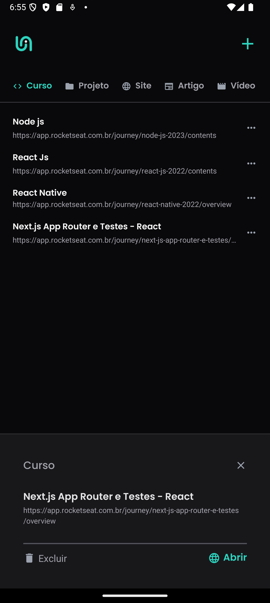

# Link 

- Aplicação usando React Native
- Usando Expo
- Usando NativeWind
- Async Storage

## Rodar o projeto

- primeiro instalar o nodejs versão LTS
- npm install para instalar todas as dependência
- npm start ou npx  expo  start para executar o projeto 